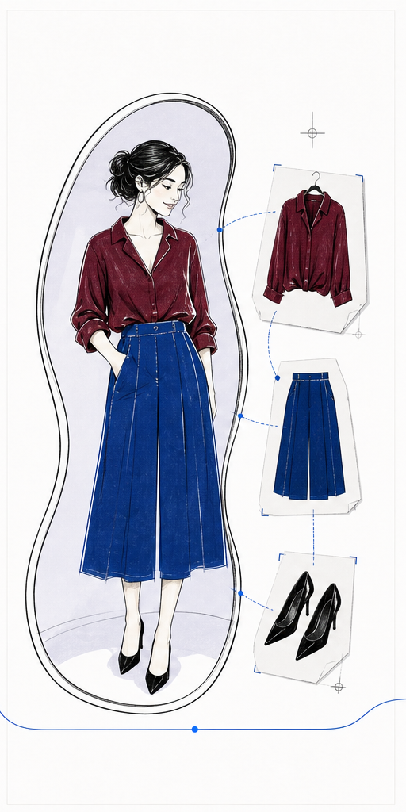
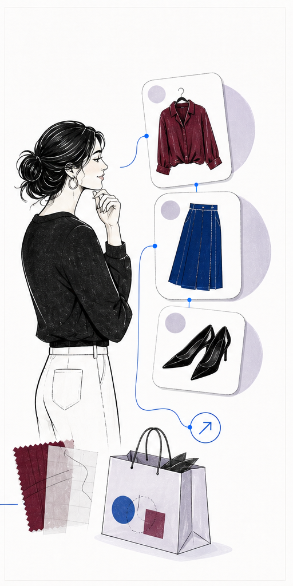
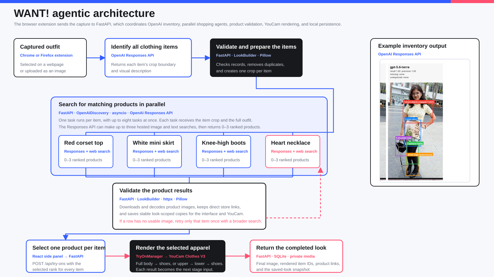

<p align="center">
  
</p>

<p align="center">
  WANT! is an <strong>agentic fashion workflow</strong> that turns any outfit you spot online into a shoppable look you can try on yourself, without leaving the page that inspired you.
</p>

<p align="center">
  Built for the <a href="https://youcam-api.devpost.com/">YouCam API Skin AI &amp; Apparel VTO Hackathon</a>
  using <strong>YouCam Clothes V3</strong>.
</p>

<table>
  <tr>
    <td align="center"></td>
    <td align="center"></td>
    <td align="center"></td>
  </tr>
  <tr>
    <td align="center"><strong>Grab the look</strong><br>Box an outfit on any page or upload an image.</td>
    <td align="center"><strong>Try it on</strong><br>See the selected clothing on your own photo.</td>
    <td align="center"><strong>Get the outfit</strong><br>Open real products directly at their stores.</td>
  </tr>
</table>

## The internet is the inspiration. WANT! is the fitting room.

WANT! turns a look from a video, post, editorial, or webpage into a complete
set of real products and a personalized YouCam try-on.

1. **Capture what caught your eye.** Press **Alt+W** and draw around an outfit,
   or upload a screenshot.
2. **Find the complete outfit.** OpenAI identifies the visible clothing, shoes,
   and accessories. A concurrent shopping agent then finds up to three real
   products for each distinct item.
3. **Choose the closest recreation.** Select one option in every product row.
   That exact combination becomes the outfit used by the rest of the workflow.
4. **See it on you.** YouCam Clothes V3 renders the supported selections on your
   photo in sequence. Anything not rendered stays clearly marked and shoppable.
5. **Get it or keep it.** Open products directly at their retailers, with known
   prices preserved, or save the finished look privately with you as the model.

<!--
## Product proof

When the final demo screenshots are ready, insert two wide images here:

1. Capture on a real webpage -> complete item inventory -> shoppable product rows.
2. User-selected products -> YouCam result -> product links and saved look.

The screenshots should be actual WANT! UI from one successful run, not mockups.
-->

## The agentic workflow behind WANT!

The user gives WANT! one goal, **recreate this look on me**, rather than a list
of products to search. A local FastAPI service carries that goal through OpenAI
visual inventory and concurrent product discovery, local evidence validation,
the user's exact selections, YouCam Clothes V3 rendering, and private local
persistence.

<p align="center">
  
</p>

<p align="center"><sub><a href="docs/architecture.svg">Open the editable SVG</a></sub></p>

> **Measured performance:** A repeatable multi-look benchmark produced 30
> detected items, 38 retail products, only two honest fallbacks, 34.7 seconds
> mean latency, and 49.1 seconds maximum latency. A measured end-to-end YouCam
> render completed in 43.3 seconds. This sits alongside automated backend tests
> and repeated browser-to-try-on runs.

## Run WANT! locally

WANT! uses the same local FastAPI service for a Chrome side panel or Firefox
sidebar. The browser builds live on dedicated branches:

- [`main`](https://github.com/snowsadh/want/tree/main) for Chrome
- [`firefox`](https://github.com/snowsadh/want/tree/firefox) for Firefox

### Requirements

- Chrome 116 or newer, or Firefox 142 or newer
- Python 3.12 and [`uv`](https://docs.astral.sh/uv/)
- Node.js and [`pnpm`](https://pnpm.io/)
- OpenAI and YouCam API keys

### 1. Get the browser build

```bash
git clone https://github.com/snowsadh/want.git
cd want
git switch main       # Chrome
# or: git switch firefox
```

### 2. Configure the providers

```bash
cp .env.example .env
```

Add the two server-side keys to `.env`:

```text
OPENAI_API_KEY=...
YOUCAM_API_KEY=...
```

The keys stay in the local API environment and are never bundled into the
extension.

### 3. Install and build

```bash
uv sync
pnpm install --frozen-lockfile
pnpm build
```

### 4. Start the local API

```bash
uv run uvicorn apps.api.app.main:app --host 127.0.0.1 --port 8000
```

### 5. Load the extension

#### Chrome

1. Open `chrome://extensions`.
2. Enable **Developer mode**.
3. Select **Load unpacked** and choose `apps/extension/dist`.

#### Firefox

1. Open `about:debugging#/runtime/this-firefox`.
2. Select **Load Temporary Add-on**.
3. Choose `apps/extension/dist/manifest.json`.

Open WANT! from the toolbar and add a clear full-body photo. Visit a page with
an outfit, press **Alt+W**, choose **Pick a look**, and draw around it. The
shortcut can be changed at `chrome://extensions/shortcuts` or in Firefox under
**Manage Extension Shortcuts**.

## Privacy

- WANT! acts only after a deliberate capture, upload, search, or try-on request.
- API keys stay in the local FastAPI environment and out of the extension.
- Photos, captures, product media, generated images, and saved looks stay in
  ignored local directories and SQLite rather than a public feed.

Read the full [privacy policy](docs/privacy-policy.md) for provider and data
handling details.

<details>
<summary><strong>Technical details and repository map</strong></summary>

### Stack

| Layer | Technology | Responsibility |
| --- | --- | --- |
| Browser experience | Manifest V3, TypeScript, React, Vite | Capture, profile, product selection, try-on results, and saved looks |
| Local API | Python 3.12, FastAPI, Pydantic | Server-side keys, request validation, orchestration, and API contracts |
| Visual inventory and shopping | OpenAI Responses API, hosted image and text search, `asyncio` | Detect every wearable and run one concurrent product shopper per item |
| Product evidence | `httpx`, Pillow | Validate, decode, and preserve usable product images and links |
| Virtual try-on | YouCam Clothes V3 | Render the selected supported apparel on the user's photo |
| Private persistence | SQLite and local media files | Store the profile, captures, products, render stages, and saved looks |

### Development server

```bash
uv run uvicorn apps.api.app.main:app --host 127.0.0.1 --port 8000 --reload
```

Re-run `pnpm build` and reload the unpacked extension after frontend changes.

### Verification

```bash
uv run ruff check apps tests
uv run pytest -q
pnpm typecheck
pnpm build
```

### Code map

- `apps/extension/src/background.ts` opens the side panel or sidebar, activates
  capture mode, and carries a pending capture into the extension UI.
- `apps/extension/src/content.ts` owns the on-page drag-selection experience.
- `apps/extension/src/sidepanel/capture.ts` crops the selected pixels,
  preferring the original page image when possible.
- `apps/extension/src/sidepanel/main.tsx` contains the React screens, product
  rows, selection state, try-on result, and saved-look flow.
- `apps/extension/src/api.ts` is the browser client for the local FastAPI
  service; `types.ts` mirrors its response contracts.
- `apps/api/app/main.py` wires the routes and process-lifetime services.
- `openai_discovery.py` owns the OpenAI Responses inventory and concurrent
  shopping calls; `openai_prompts.py` contains their prompts.
- `look_builder.py` validates inventory records, creates crops, downloads and
  decodes product images, retries empty rows, and assembles the product result.
- `try_on.py` validates the selected ranks and sequences supported garment
  regions through `youcam.py`.
- `database.py` and `media.py` store the local profile, saved looks, captures,
  product media, render stages, and final YouCam images.
- `contracts.py` defines the backend data contracts; `tests/` protects API,
  normalization, selection, persistence, and YouCam behavior.

The detailed behavior lives in [`docs/product-spec.md`](docs/product-spec.md).
The accepted runtime and provider evaluation live in
[`docs/agentic-plan.md`](docs/agentic-plan.md).

</details>
